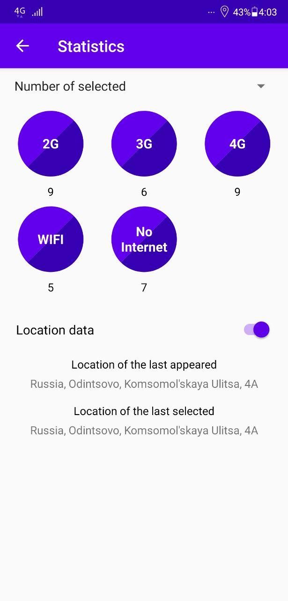
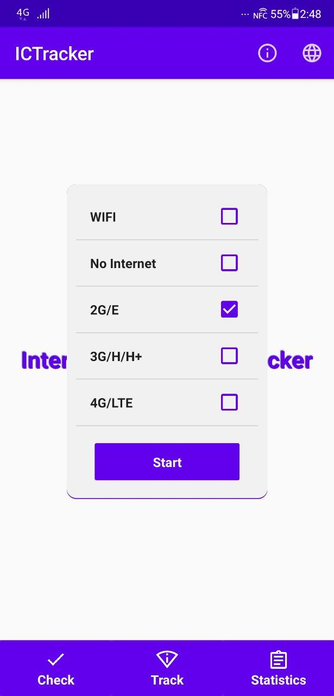
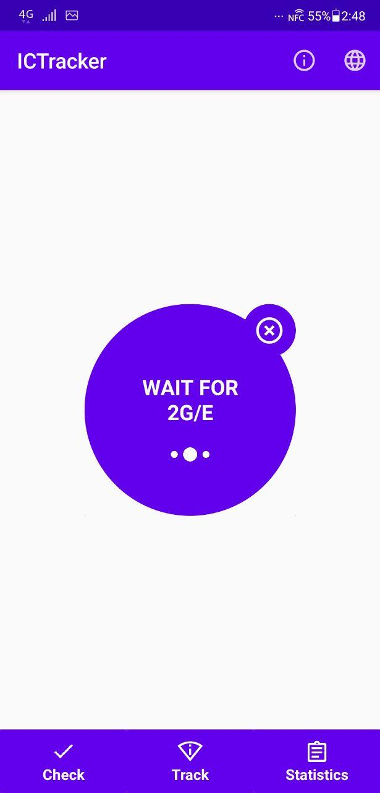
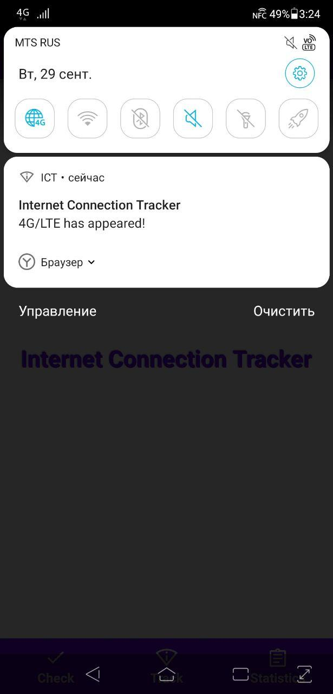

## Internet Connection Tracker (ICT)

My second course work in HSE, Faculty of Computer Science, Software Engineering.

|                  Main window                   |              Statistics window                |
|:----------------------------------------------:|:---------------------------------------------:|
|  |  |

This application tracks a chosen type of internet connection on your android smartphone. When this connection appears, you'll get appropriate notification:

|                 Track window                    |                  Tracking                    |                   Notification                   |
|:-----------------------------------------------:|:--------------------------------------------:|:------------------------------------------------:|
|  |   |   |

Application supports two languages: russian and english.
