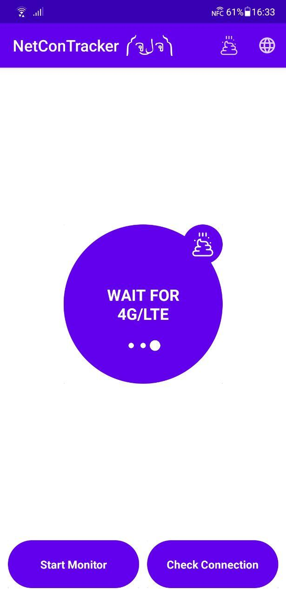
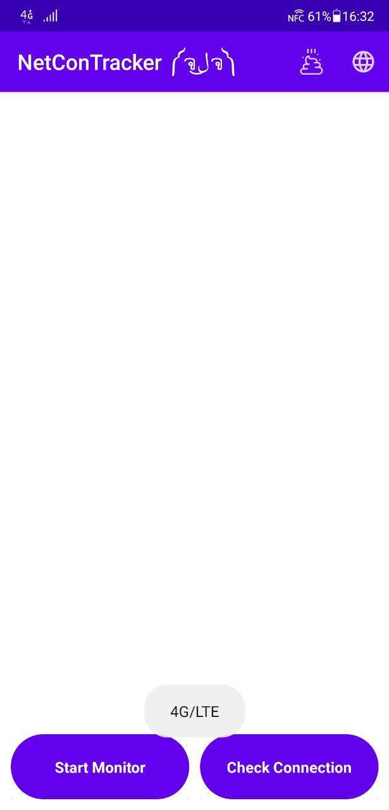
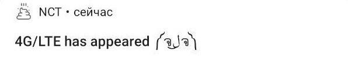
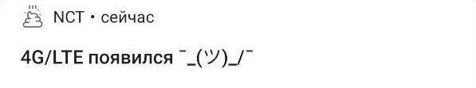

## Internet Connection Tracker (ICT)

My coursework ༼ຈل͜ຈ༽.
<!--|                  Main window                   |              Monitoring 4G/LTE             |                 Checking Connection                 |-->
<!--|:----------------------------------------------:|:------------------------------------------:|:---------------------------------------------------:|-->
<!--|  |  |  |-->

<!--**This application monitors a chosen type of internet connection on your android smartphone (like on second image). When this connection appears, you'll get appropriate notification:**-->

<!--|               English notification               |                Russian notification               |-->
<!--|:------------------------------------------------:|:-------------------------------------------------:|-->
<!--|  |   |-->

<!--**Application supports two languages: russian and english.**-->
